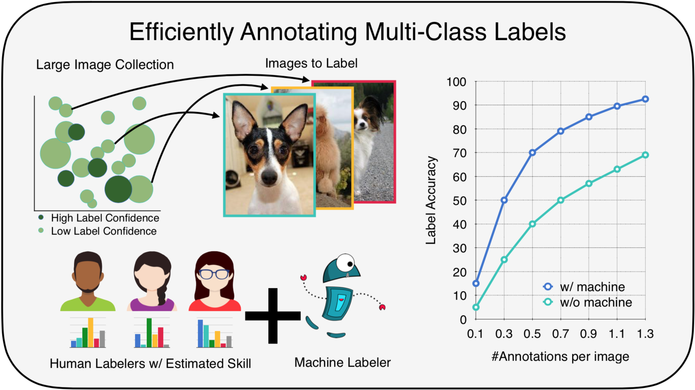

# Towards Good Practices for Efficiently Annotating Large-Scale Image Classification Datasets

This is the official implementation of *"Towards Good Practices for Efficiently Annotating Large-Scale Image Classification Datasets"* (CVPR 2021).
For more details, please refer to:
----------------------- ------------------------------------
**Towards Good Practices for Efficiently Annotating Large-Scale Image Classification Datasets**

[Yuan-Hong Liao](https://andrewliao11.github.io), [Amlan Kar](https://amlankar.github.io), [Sanja Fidler](http://www.cs.utoronto.ca/~fidler/)

University of Toronto 

[[Paper]](https://arxiv.org/abs/2104.12690) [[Video]]() [[Project]](https://fidler-lab.github.io/efficient-annotation-cookbook/)

**CVPR2021 Oral**



Data  is  the  engine  of  modern  computer  vision,  which necessitates collecting large-scale datasets. This is expensive, and guaranteeing the quality of the labels is a major challenge. In this paper, we investigate efficient annotation strategies for collecting multi-class classification labels fora  large  collection  of  images. While  methods  that  exploit learnt  models  for  labeling  exist,  a  surprisingly  prevalent approach is to query humans for a fixed number of labels per datum and aggregate them, which is expensive. Building  on  prior  work  on  online  joint  probabilistic  modeling of  human  annotations  and  machine  generated  beliefs,  we propose  modifications  and  best  practices  aimed  at  minimizing human labeling effort. Specifically, we make use ofadvances in self-supervised learning, view annotation as a semi-supervised learning problem, identify and mitigate pitfalls and ablate several key design choices to propose effective guidelines for labeling. Our analysis is done in a more realistic simulation that involves querying human labelers, which uncovers issues with evaluation using existing worker simulation methods. Simulated experiments on a 125k image subset of the ImageNet dataset with 100 classes showthat it can be annotated to 80% top-1 accuracy with 0.35 annotations per image on average, a 2.7x and 6.7x improvement over prior work and manual annotation, respectively.

----------------------- ------------------------------------


## Code usage

- Downdload the extracted [BYOL](https://papers.nips.cc/paper/2020/file/f3ada80d5c4ee70142b17b8192b2958e-Paper.pdf) features and change root directory accordingly
```
wget -P data/features/ http://www.cs.toronto.edu/~andrew/research/cvpr2021-good_practices/data/byol_r50-e3b0c442.pth_feat1.npy 
```

Replace `REPO_DIR` ([here](https://github.com/fidler-lab/efficient-annotation-cookbook/blob/master/data/__init__.py)) with the absolute path to the repository.


- Run online labeling with simulated workers
  - `<EXPERIMENT>` can be `imagenet_split_0~5`, `imagenet_animal`, `imagenet_100_classes`
  - `<METHOD>` can be `ds_model`, `lean`, `improved_lean`, `efficient_annotation`
  - `<SIMULATION>` can be `amt_structured_noise`, `amt_uniform_noise`
```python
python main.py experiment=<EXPERIMENT> learner_method=<METHOD> simulation <SIMULATION>
```
To change other configurations, go check the [config.yaml](https://github.com/fidler-lab/efficient-annotation-cookbook/blob/master/online_label/config/config.yaml) here.

## Code Structure
There are several components in our system: `Sampler`, `AnnotationHolder`, `Learner`, `Optimizer` and `Aggregator`.

- `Sampler`: We implement `RandomSampler` and `GreedyTaskAssignmentSampler`. For `GreedyTaskAssignmentSampler`, you need to specify an additional flag `max_annotation_per_worker`

For example, 
```python
python main.py experiment=imagenet_animal learner_method=efficient_annotation simulation=amt_structured_noise sampler.algo=greedy_task_assignment sampler.max_annotation_per_worker=2000
```

- `AnnotationHolder`: It holds all information of each example including worker annotation, ground truth and current risk estimation. For simulated worker, you can call `annotation_holder.collect_annotation` to query annotations. You can also sample the annotation outside and add them by calling `annotation_holder.add_annotation`

- `Learner`: We implement `DummyLearner` and `LinearNNLearner`. You can use your favorite architecture by overwriting `NNLearner.init_learner`

- `Optimizer`: We implement `EMOptimizer`. By calling `optimizer.step`, the optimizer perform EM for a fixed number of times unless it's converged. If `DummyLearner` is not used, the optimizer is expected to call `optimizer.fit_machine_learner` to train the machine learner and perform prediction over all data examples.

- `Aggregator`: We implement `MjAggregator` and `BayesAggregator`. `MjAggregator` performs majority vote to infer the final label. `BayesAggregator` treat the ground truth and worker skill as hidden variables and infer it based on the observation (worker annotation).


## Citation
If you use this code, please cite:
```
@misc{liao2021good,
      title={Towards Good Practices for Efficiently Annotating Large-Scale Image Classification Datasets}, 
      author={Yuan-Hong Liao and Amlan Kar and Sanja Fidler},
      year={2021},
      eprint={2104.12690},
      archivePrefix={arXiv},
      primaryClass={cs.CV}
}
```
