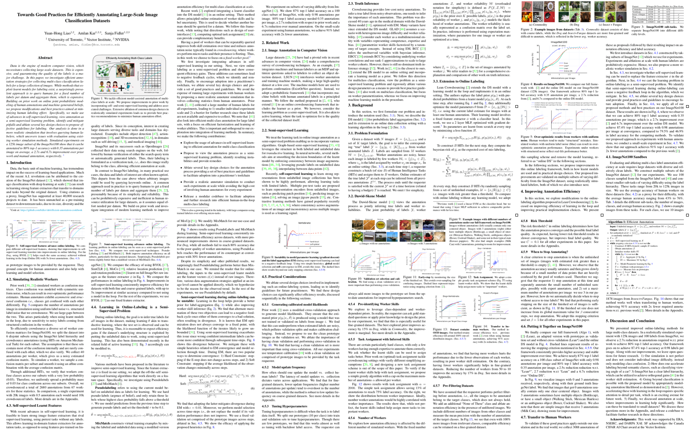

```{r setup, include=FALSE}
knitr::opts_chunk$set(echo = FALSE)

# Learn more about creating blogs with Distill at:
# https://rstudio.github.io/distill/blog.html

```


Data is the engine of modern computer vision, which necessitates collecting large-scale datasets. This is expensive, and guaranteeing the quality of the labels is a major challenge. We investigate **efficient annotation strategies** for collecting multi-class classification labels for a large collection of images. 


# Laborious Annotation Process

A common approach used in practice is to query humans to get a fixed number of labels per datum and aggregate them [@lin2014microsoft;@kaur2019foodx;@russakovsky2015imagenet] presumably because of its simplicity and reliability. This can be prohibitively expensive and inefficient in human resource utilization for large datasets, as it assumes equal effort needed per datum.


# Background and Testbed

### How to aggregate labels: DS model

The Dawid-Skene model views the annotation process as jointly inferring true labels and worker skills. 
The joint probability of true labels $\mathcal{Y}$, annotations $\mathcal{Z}$, and worker skills $\mathcal{W}$ is defined as the product of the prior of true labels and worker skills and the posterior of the annotations.
We first define the notations, $\mathcal{I_j}$: the images annotated by the $j^{th}$ worker, $\mathcal{W_i}$: the workers that annotate the $i^{th}$ image, $N$: the number of images, $M$: the number of workers.
Now, we can define the joint probability as
$P(\mathcal{Y}, \mathcal{Z}, \mathcal{W}) = \prod_{i \in [N]} p(y_i) \prod_{j \in [M]} p(w_j) \prod_{i, j \in \mathcal{W_i}} p(z_{ij} | y_i, w_j)$. 
In practice, inference is performed using expectation maximization, where parameters for images or workers are optimized at a time,
$$
\begin{align}
\bar{y_i} &= \arg \max p(y_i) \prod_{j \in \mathcal{W_i}} p(z_{ij} | y_i, \bar{w_j}) \\
\bar{w_j} &= \arg \max p(w_j) \prod_{i \in \mathcal{I_j}} p(z_{ij} | \bar{y_i}, w_j) \\
\end{align}
$$


Prior work[@Branson_2017_CVPR] moves to an online setting and improves DS model by using machine learning model predictions as image prior $p(y_i)$, opening up the window of incorporating machine learner and DS model.
However, they only perform experiments in a small-scale setting.
We ask ourselves: **How many annotations can we possibly reduce to annotate a large scale image classification dataset, such as ImageNet?**

### Testbed: ImageNet100 Sandbox
Evaluating and ablating multi-class label annotation efficiency at scale requires large datasets with diverse and relatively clean labels. We construct multiple subsets of the ImageNet dataset [@russakovsky2015imagenet] for our experiments. The following table shows the details of the different subsets in ImageNet100 Sandbox. 

| Dataset         	| #Images 	| #Classes 	| Worker Acc. 	| Fine-Grained 	|
|-----------------	|:-------:	|:--------:	|:-----------:	|:------------:	|
| Commodity       	|  20140  	|    16    	|     0.76    	|              	|
| Vertebrate      	|  23220  	|    18    	|     0.72    	|              	|
| Insect + Fungus 	|  16770  	|    13    	|     0.65    	|       V      	|
| Dog             	|  22704  	|    19    	|     0.43    	|       V      	|
| ImageNet100     	|  125689 	|    100   	|     0.7     	|       V      	|

Prior work [@hua2013collaborative; @long2015multi] simulates workers as confusion matrices. Class confusion was modeled with symmetric uniform noise, which can result in *over-optimistic* performance estimates. Human annotators exhibit asymmetric and structured confusion *i.e.*, classes get confused with each other differently. In Fig.\@ref(fig:structured-workers), we compare the number of annotations per image in simulation using uniform label noise vs. structured label noise that we crowdsource. We see significant gaps between the two. This arises particularly when using learnt models in the loop due to sensitivity to noisy labels coming from structured confusion in the workers. Therefore, we use simulated workers with structured noise in ImageNet100 Sandbox.

```{r structured-workers, fig.cap="Over-optimistic results from workers with uniform noise. Human workers tend to make *structured* mistakes. Simulated workers with uniform label noise (blue) can result in over-optimistic annotation performance. Experiments under workers with structured noise reflect real-life performance better.", echo=FALSE, layout="l-body-outset"}
knitr::include_graphics("assets/paper_figures/plot_unfiorm_structured_noise_pseudolabel.pdf")
```


We simulate the process of annotating ImageNet100 and perform various ablation on the system, spanning from models, workers, and data itself.
We end up being **2.7x efficient (w/ 63% less annotations)** w.r.t prior work [@Branson_2017_CVPR] and **6.7x efficient (w/ 85% less annotations)** w.r.t. manual annotations [@dawid1979maximum].

In the following, we show how each component affects the final efficiency:


# Matters of Model Learning

### Online-Labeling is a Semi-Supervised Problem

During online-labeling, the goal is to infer true labels for all images in the dataset, making model learning akin to transductive learning [@joachims1999transductive], where the test set is observed and can be used for learning. Thus, it is reasonable to expect efficiency gains if the dataset’s underlying structure is exploited by putting the unlabeled data to work, using semi-supervised learning. In Fig.\@ref(fig:semi-supervised) we perform *Peudolabel* and *Mixmatch* in online-labeling.

```{r semi-supervised, fig.cap="Incorporating semi-supervised approaches consistently increases efficiency. Note that semi-supervised learning does not have a significant boost in Dog subset due ot the poor worker quality (43%). When eyeballing the subset, we also find ineligible label errors in the Dog subset.", echo=FALSE, layout="l-body-outset"}
knitr::include_graphics("assets/paper_figures/plot_semi.pdf")
```

### Self-Supervised Learning Advances Online-Labeling
With recent advances in self-supervised learning, it is feasible to learn strong image feature extractors that rival supervised learning, using pretext tasks without any label. This allows learning in-domain feature extractors for annotation tasks, as opposed to using features pre-trained on ImageNet
We compare the efficacy of using BYOL [@grill2020bootstrap], SimCLR [@chen2020simple], MoCo [@he2019moco], relative location prediction [@doersch2015unsupervised] and rotation prediction [@gidaris2018unsupervised] learnt on full ImageNet raw images as the feature extractor. In Fig.\@ref(fig:self-supervised), we show that improvements in self-supervised learning consistently increase the efficiency for datasets with both fine and coarse-grained labels, with up to **5x improvement** at similar accuracy compared to not using a machine learning model in the loop (online DS). 


```{r self-supervised, fig.cap="The improvements in self-supervised learning can be translated seemingly to online labeling. Note that no semi-supervised tricks are applied in this figure.", echo=FALSE, layout="l-body-outset"}
knitr::include_graphics("assets/paper_figures/plot_self_none.pdf")
```

### Clean Validation set Matters in Accuracy and Calibration Error
The validation set plays an important role in online-labeling. It is used to perform model selection and model calibration.
Prior work [@Branson_2017_CVPR] uses a modified cross-validation approach to generate model likelihoods. We find that this could underperform when the estimated labels are noisy, which pollutes the validation set and makes calibration challenging. Instead, we propose to use the clean prototype images as the validation set. In our paper, we use 10 prototype images per class. 
We perform 3-fold cross-validation in this experiment. 
When not using cross-validation, we either randomly select a subset as the validation set or use the (clean) prototype images as the validation set. 
In Fig.\@ref(fig:clean-validation), we ablate the importance of having a clean validation set and performing cross-validation in terms of accuracy and expected calibration error on the most challenging subset, the Dog subset.

```{r clean-validation, fig.cap="The validation set plays an important role of online-labeling. It is used to perform model selection and model calibration. We compare the importance of using clean examples as the validation set. When not using a clean validation set, the model tends to produce poorly calibrated probability (w/ calibration method applied [@guo2017calibration]), resulting in poor accuracy.", echo=FALSE, layout="l-body"}
knitr::include_graphics("assets/paper_figures/plot_prototype_as_val.pdf")
```

# Matters of Workers


### It's worth using Gold Standard Question sometimes

In reality, the requestor can ask gold standard questions or apply prior knowledge to design the prior $p(w_j)$. 
We explore two possible prior **A)** Considering class identity and **B)** Considering worker identity.
To consider the class identity, the task designer needs to have a clear thought of which classes are more difficult than others. 
To consider the worker's identity, the task designer needs to query several gold standard questions from each worker.
In Fig.\@ref(fig:prior-change), we find that considering worker identity is especially useful for fine-grained datasets, such as Dog subset, improving 15 accuracy points in Dog, while in Commodity, the improvement is marginal.

```{r prior-change, fig.cap="For the fine-grained dataset, it is usually worth using gold standard questions to get a better prior over worker skills. The number appended in the legend denotes the prior strength.",  echo=FALSE, layout="l-body-outset"}
knitr::include_graphics("assets/paper_figures/plot_prior_change-10.pdf")
```

### Tradeoff between number of workers and time cost

One way to speed up the dataset annotation process is to hire more workers at the same time. However, under a fixed number of total annotations, having more workers means having fewer observations for each worker, resulting in poor worker skill estimation.
We explore this tradeoff by manipulating the number of workers involved in Fig.\@ref(fig:number-workers). 
The gap is surprisingly high in the fine-grained dataset (14% accuracy points difference in Dog subset), while there is nearly no tradeoff in the coarse-grained dataset, such as Commodity subset.

```{r number-workers, fig.cap="Hiring more workers saves the total time to annotate a dataset, while it sacrifices the accuracy of the dataset sometimes. For the fine-grained dataset, the gap between using 10 workers and 1000 workers is around 14 accuracy points, while in the coarse-grained dataset, there is nearly no tradeoff.",  echo=FALSE, layout="l-body-outset"}
knitr::include_graphics("assets/paper_figures/plot_worker_change.pdf")
```


# Matters of Data

### Pre-filtering Dataset to some extent

We have assumed that the requestor performs perfect filtering before annotation, *i.e.*, all the images to be annotated belong to the target classes, which does not always hold. We add an additional “None of These” class and ablate annotation efficiency in the presence of unfiltered images.
We include different numbers of images from other classes and measure the mean precision with the number of annotations of the target classes.
In Fig.\@ref(fig:distraction-image), we see that even with 100% more images from irrelevant classes, we can retain comparable efficiency on a fine-grained dataset.

```{r distraction-image, out.width="50%", fig.cap="We intentionally add some irrelevance images from other classes to mimic the real-world cases. In our experiments, we find that even with 100% more images from irrelevant classes, we can still retain comparable efficiency.",  echo=FALSE, layout="l-body"}
knitr::include_graphics("assets/paper_figures/plot_distraction_compare_cost_target_classes_precision.pdf")
```


### Early Stopping Saves you some Money

A clear criterion to stop annotation is when the unfinished set of images (images with estimated risk greater than a threshold) is empty.
However, we observe that the annotation accuracy usually saturates and then grows slowly because of a small number of data points that are heavily confused by the pool of workers used. Therefore we suggest that the requestor 1) stop annotation at this time and separately annotate the small number of unfinished samples, possibly with expert annotators, and 2) set a maximum number of annotations per image. In Fig.\@ref(fig:early-stopping), we show this is sufficient. We set the maximum annotations of each example to be 3 and early stop when the size of the finished set does not increase from its maximum value for 5 consecutive steps.

<aside>
In online-labeling, we estimate the risk for each example at every step. If the example's risk satisfies pre-defined threshold, we put them into finished set and will not query its annotation from workers at the next time step.
</aside>

```{r early-stopping, out.width="50%", fig.cap="We perform early stopping by monitoring the size of the finished set. This avoids over-sampling for confusing images and leaves the rest of them to expert workers if possible. Dashed lines represent the trajectories using stopping criterion from prior work [@Branson_2017_CVPR]",  echo=FALSE, layout="l-body"}
knitr::include_graphics("assets/paper_figures/plot_stopping.pdf")
```


# Discussion

We presented improved online-labeling methods for large multi-class datasets. In a realistically simulated experiment with 125k images and 100 labels from ImageNet, we observe a 2.7x reduction in annotations required w.r.t. prior work to achieve 80% top-1 label accuracy. 
Our framework goes on to achieve 87.4% top-1 accuracy at 0.98 labels per image. 
Along with our improvements, we leave open questions for future research.
1) Our simulation is not perfect and does not consider individual image difficulty, instead only modeling class confusion.
2) How does one accelerate labeling beyond semantic classes, such as classifying the viewing angle of a car?
3) ImageNet has a clear label hierarchy, which can be utilized to achieve orthogonal gains [@van2018lean] in the worker skill estimation
4) Going beyond classification is possible with the proposed model by appropriately modeling annotation likelihood as demonstrated in [@Branson_2017_CVPR]. However, accelerating these with learning in the loop requires specific attention to detail per task, which is an exciting avenue for future work.
5) Finally, we discussed annotation at scale, where improvements in learning help significantly. How can these be translated to small datasets?

## Acknowledgments {.appendix}
This work was supported by ERA, NSERC, and DARPA XAI. SF acknowledges the Canada CIFAR AI Chair award at the Vector Institute.

This webpage is based on Distill Template generated from [here](https://rstudio.github.io/distill/)

## Paper {.appendix}


```{r, layout="l-body-outset"}

```
**This paper is accepted to CVPR2021 as Oral presentations.**

If you find this article useful or you use our code, please consider cite:
```
@inproceedings{good_practices,
    title={Towards Good Practices for Efficiently Annotating Large-Scale Image Classification Datasets},
    author={Yuan-Hong Liao and Amlan Kar and Sanja Fidler},
    booktitle={CVPR},
    year={2021}
    }
```
